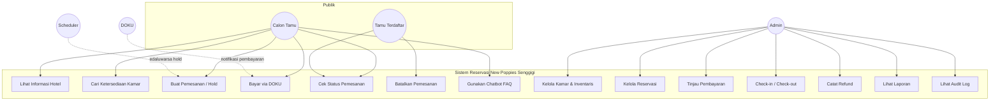

# 01 — Analisis Kebutuhan

## 1.1 Latar Belakang

New Poppies Senggigi adalah hotel butik di kawasan Senggigi, Lombok Barat. Proses
reservasi sebelumnya bergantung pada telepon dan pesan langsung, sehingga rawan
terjadi:

- pemesanan ganda (dua tamu menerima kamar yang sama),
- kesalahan perhitungan harga manual,
- tidak adanya catatan pembayaran yang terverifikasi,
- kesulitan menyusun laporan okupansi dan pendapatan.

Sistem ini dibangun untuk memindahkan proses tersebut ke kanal daring dengan
kontrol ketersediaan dan pembayaran yang dapat diaudit.

## 1.2 Ruang Lingkup

**Termasuk:** promosi hotel, pencarian ketersediaan, pemesanan daring, pembayaran
DOKU, manajemen kamar & inventaris, operasional front desk, pembatalan & refund,
laporan, chatbot FAQ, audit log.

**Tidak termasuk:** integrasi channel manager (OTA), program loyalitas,
point-of-sale restoran, housekeeping terjadwal, refund otomatis melalui API DOKU.

## 1.3 Aktor

| Aktor | Deskripsi |
|-------|-----------|
| Calon tamu (publik) | Mencari kamar & memesan tanpa wajib login |
| Tamu terdaftar | Memiliki akun, riwayat pemesanan tersimpan |
| Admin | Mengelola seluruh data master, reservasi, dan operasional |
| Sistem pembayaran (DOKU) | Aktor eksternal; mengirim notifikasi pembayaran |
| Penjadwal (scheduler) | Aktor waktu; mengedaluwarsakan hold |

## 1.4 Kebutuhan Fungsional

| Kode | Kebutuhan | Prioritas |
|------|-----------|-----------|
| KF-01 | Menampilkan informasi hotel, tipe kamar, fasilitas, dan galeri | Wajib |
| KF-02 | Mencari ketersediaan kamar berdasarkan tanggal & jumlah tamu | Wajib |
| KF-03 | Menghitung harga menginap di sisi server | Wajib |
| KF-04 | Membuat penahanan (hold) kamar selama 30 menit | Wajib |
| KF-05 | Mencegah pemesanan ganda pada kondisi akses bersamaan | Wajib |
| KF-06 | Memproses pembayaran daring melalui DOKU | Wajib |
| KF-07 | Mengonfirmasi pemesanan hanya setelah notifikasi terverifikasi | Wajib |
| KF-08 | Menampilkan status pemesanan (kode + email) | Wajib |
| KF-09 | Membatalkan pemesanan sesuai kebijakan | Wajib |
| KF-10 | Mencatat refund secara manual dengan status berjenjang | Wajib |
| KF-11 | Mengelola tipe kamar, kamar fisik, fasilitas, dan foto | Wajib |
| KF-12 | Mengelola inventaris harian dan harga per tanggal | Wajib |
| KF-13 | Mengelola promosi | Sedang |
| KF-14 | Melakukan check-in dengan penugasan kamar fisik | Wajib |
| KF-15 | Melakukan check-out dan menandai no-show | Wajib |
| KF-16 | Menyajikan laporan dan ekspor CSV | Wajib |
| KF-17 | Menyediakan chatbot FAQ | Sedang |
| KF-18 | Mencatat audit log atas perubahan penting | Wajib |

## 1.5 Kebutuhan Non-Fungsional

| Kode | Kebutuhan | Ukuran keberhasilan |
|------|-----------|---------------------|
| KNF-01 | Integritas data | Inventaris tidak pernah negatif / oversold, dibuktikan uji konkurensi |
| KNF-02 | Keamanan | Harga & status pembayaran tidak dapat dimanipulasi dari klien |
| KNF-03 | Keandalan pembayaran | Notifikasi ganda tidak menimbulkan efek ganda |
| KNF-04 | Responsif | Antarmuka dapat digunakan pada layar ponsel dan desktop |
| KNF-05 | Auditabilitas | Perubahan penting tercatat beserta pelaku dan waktu |
| KNF-06 | Keterbacaan uang | Nilai uang disimpan sebagai bilangan bulat rupiah |

## 1.6 Diagram Use Case

## 1.7 Asumsi & Batasan

1. Satu pemesanan berisi satu tipe kamar dengan jumlah kamar tertentu.
2. Refund dicatat manual; API refund otomatis DOKU tidak digunakan.
3. Status "pemeliharaan" kamar bersifat kondisi saat ini, bukan rentang tanggal.
4. Ketersediaan bersumber dari inventaris harian, dibatasi jumlah kamar fisik yang layak jual.
