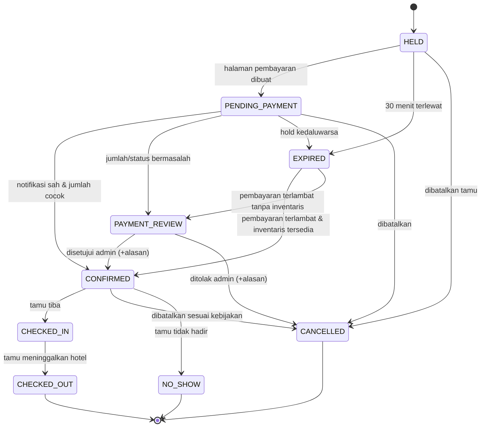

# 02 — Aturan Bisnis

Setiap aturan di bawah ini diimplementasikan pada kode dan diverifikasi oleh
pengujian otomatis (lihat `08-testing-plan.md`).

## 2.1 Malam Menginap

Tanggal check-out **bukan** malam menginap.

```
Check-in 10 Agustus, check-out 13 Agustus
Malam menginap: 10, 11, 12  → 3 malam
```

Implementasi: `App\Support\StayPeriod`.

## 2.2 Ketersediaan

```
tersedia = total_inventory − blocked_inventory − held_inventory − confirmed_inventory
```

- Ketersediaan **hanya** bersumber dari tabel `room_type_inventories`, bukan dari
  jumlah kamar fisik mentah.
- Untuk menginap beberapa malam, kamar tersedia hanya jika **setiap** malam
  memiliki ketersediaan yang cukup (nilai minimum lintas malam).
- Jumlah kamar fisik aktif & tidak dalam pemeliharaan menjadi batas atas.

Implementasi: `AvailabilityService`.

## 2.3 Pencegahan Pemesanan Ganda

Saat membuat hold:

1. Buka transaksi database.
2. Kunci baris inventaris seluruh malam menginap dengan `lockForUpdate()`,
   **selalu terurut menaik berdasarkan tanggal** (mencegah deadlock silang).
3. Periksa ulang ketersediaan **di dalam kunci**.
4. Tolak bila ada satu malam saja yang tidak mencukupi.
5. Tambah `held_inventory`, buat booking, item, dan snapshot harga per malam.
6. Commit.

Nilai inventaris dijaga dengan `GREATEST(..., 0)` sehingga tidak pernah negatif.
Deadlock dicoba ulang maksimal 3 kali.

Implementasi: `BookingInventoryService`, `BookingService`.

## 2.4 Harga

Urutan perhitungan (seluruhnya di server, bilangan bulat rupiah):

```
harga dasar per malam
+ penyesuaian akhir pekan
+ penyesuaian musiman
+ biaya tamu tambahan
= subtotal sebelum diskon

subtotal sebelum diskon − diskon promo = subtotal setelah diskon
subtotal setelah diskon + pajak + biaya layanan = total akhir
```

- Harga dari peramban **tidak pernah** dipercaya.
- Snapshot harga per malam disimpan di `booking_item_nights` dan bersifat tetap:
  perubahan harga di kemudian hari tidak mengubah pemesanan yang sudah ada.
- Jumlah seluruh `final_amount` per malam **sama persis** dengan total akhir
  (sisa pembulatan diserap malam terakhir).

Implementasi: `PricingService`.

## 2.5 Promosi

Promo ditolak apabila: tidak aktif, kuota habis, tipe kamar tidak termasuk,
minimal malam belum terpenuhi, minimal transaksi belum terpenuhi, di luar jendela
tanggal pemesanan, atau di luar jendela tanggal menginap.

- Diskon persentase dibatasi `max_discount` bila diisi.
- Diskon tidak pernah melebihi subtotal.
- Promo otomatis: dipilih yang memberi potongan terbesar dan valid.

Implementasi: `PromotionService`.

## 2.6 Status Pemesanan



Transisi di luar diagram ditolak oleh `BookingStatus::canTransitionTo()`
(mis. `CHECKED_OUT → HELD`, `CANCELLED → CHECKED_IN`).

## 2.7 Status Pembayaran

`UNPAID → PENDING → PAID` pada jalur normal; `FAILED`, `EXPIRED`, `REVIEW`,
`REFUND_PENDING`, `PARTIALLY_REFUNDED`, `REFUNDED` untuk jalur lain.

Aturan kunci: **pemesanan yang belum dibayar tidak dapat direfund.**

## 2.8 Aturan Pembayaran

| Situasi | Tindakan sistem |
|---------|-----------------|
| Notifikasi sah, jumlah & mata uang cocok | `PAID` + `CONFIRMED`, held→confirmed, email konfirmasi, audit |
| Notifikasi ganda | Diabaikan (unik pada `payment_events`); tanpa efek ganda |
| Signature tidak valid | Ditolak (HTTP 401), tanpa perubahan apa pun, dicatat sebagai peristiwa keamanan |
| Jumlah tidak cocok | Tidak dikonfirmasi → `PAYMENT_REVIEW` |
| Pembayaran gagal | Attempt `FAILED`; pemesanan tetap hidup selama hold berlaku |
| Hold kedaluwarsa | `EXPIRED`, inventaris dilepas, URL pembayaran lama tidak berlaku |
| Pembayaran terlambat, inventaris ada | Inventaris diambil kembali, `CONFIRMED`, ditandai pemulihan terlambat |
| Pembayaran terlambat, inventaris habis | `PAYMENT_REVIEW` untuk penanganan manual/refund |
| Status penyedia tidak dikenal | `PAYMENT_REVIEW` — **tidak pernah** dikonfirmasi otomatis |

## 2.9 Pembatalan

- `HELD` / `PENDING_PAYMENT` / `CONFIRMED` / `PAYMENT_REVIEW`: dapat dibatalkan.
- `CHECKED_IN` / `CHECKED_OUT`: tidak dapat dibatalkan.
- Alasan wajib diisi.
- Pembatalan melepas inventaris sesuai jenisnya (held atau confirmed).
- Pembatalan **bukan** refund: pemesanan berbayar menjadi `REFUND_PENDING`.
- Kebijakan pembatalan disimpan sebagai snapshot pada pemesanan.

### Biaya pembatalan berjenjang & refund otomatis

Saat pemesanan **berbayar** dibatalkan, sistem menghitung refund secara otomatis
dari jumlah yang benar-benar dibayarkan (bukan total tercatat) dan langsung
membuat record refund berstatus `REQUESTED` — admin cukup menyelesaikan payout.

| Waktu pembatalan | Refund |
|------------------|--------|
| ≥ jendela gratis sebelum check-in (default 24 jam) | **Penuh**, tanpa biaya |
| Setelah jendela gratis, sebelum check-in | Terbayar − **biaya pembatalan** (`cancellation_fee_percent`, default 50%) |
| Saat/ setelah check-in | Tidak ada (ditangani sebagai no-show / check-out) |

- Besaran biaya dapat diubah lewat Admin → Pengaturan (`cancellation_fee_percent`).
- Refund tidak pernah melebihi jumlah terbayar, dan bila refund = 0 tidak ada
  record yang dibuat (namun pemesanan tetap `REFUND_PENDING` bila sudah dibayar).
- Rincian biaya disimpan pada `cancellation_requests.policy_snapshot`.
- **Pergerakan uang tetap manual** (API auto-refund DOKU tidak dipakai, lihat A6);
  yang otomatis adalah perhitungan dan pembuatan record-nya.

## 2.10 Refund

- Refund dicatat manual dan diberi label **Manual**.
- Total refund tidak pernah melebihi jumlah yang benar-benar dibayarkan
  (diperiksa saat pengajuan **dan** saat penyelesaian).
- Hanya status `SUCCEEDED` yang mengurangi nilai terbayar dan mengubah status
  pemesanan menjadi `REFUNDED` / `PARTIALLY_REFUNDED`.

## 2.11 Check-in & Check-out

- Check-in hanya untuk pemesanan `CONFIRMED`.
- Kamar fisik harus: sesuai tipe, aktif, tidak dalam pemeliharaan, dan **tidak
  tumpang tindih** dengan penugasan lain.
- Tanggal check-out bersifat eksklusif, sehingga tamu berikutnya boleh masuk pada
  hari tamu sebelumnya keluar.
- Check-in lebih awal wajib disertai alasan dan tercatat pada audit log.
- Check-out menutup penugasan kamar sehingga kamar dapat dipakai kembali.
- Biaya tambahan tidak pernah dikenakan otomatis.

## 2.12 Pendapatan

```
pendapatan bersih = pendapatan kotor − diskon − refund berhasil
```

Hanya pemesanan berstatus `CONFIRMED`, `CHECKED_IN`, `CHECKED_OUT` yang dihitung.
Percobaan pembayaran `FAILED` dan `EXPIRED` **tidak pernah** dihitung sebagai
pendapatan; refund yang belum berstatus `SUCCEEDED` tidak mengurangi pendapatan.

## 2.13 Akses Data Pemesanan

Detail pemesanan hanya ditampilkan kepada: pemilik akun, staf, atau pengunjung
yang telah memverifikasi **kode pemesanan + email**. Kode pemesanan saja tidak
pernah cukup, dan pesan galat dibuat generik agar tidak dapat dipakai menebak kode.
