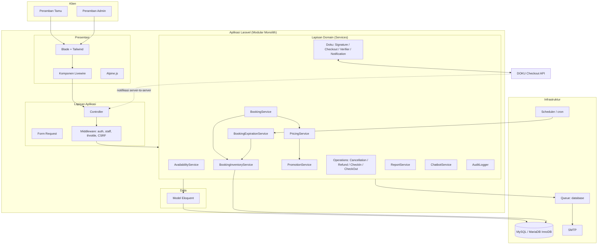

# 03 — Arsitektur Sistem

## 3.1 Gaya Arsitektur

**Modular Monolith** di atas Laravel. Seluruh modul berada dalam satu basis kode
dan satu database, namun dipisahkan berdasarkan domain melalui namespace layanan
(`App\Services\<Domain>`). Pilihan ini sesuai untuk skala satu hotel: sederhana
untuk dioperasikan, namun tetap rapi untuk dibaca dan diuji.

## 3.2 Lapisan

| Lapisan | Isi | Aturan |
|---------|-----|--------|
| Presentasi | Blade, Livewire, Alpine.js, Tailwind | Tipis; tanpa logika bisnis |
| Aplikasi | Controller, Livewire component, Form Request | Validasi & orkestrasi |
| Domain | `App\Services\*`, Enum, DTO (`App\Support`) | Seluruh aturan bisnis |
| Data | Eloquent Model, Migration | Skema & relasi |
| Infrastruktur | Queue, Scheduler, Mail, HTTP client DOKU | Integrasi eksternal |

Prinsip: **controller dan komponen Livewire tetap tipis; logika bisnis berada di
service.**

## 3.3 Diagram Arsitektur

## 3.4 Modul

| Modul | Namespace layanan | Tabel utama |
|-------|-------------------|-------------|
| Autentikasi & otorisasi | — (middleware `staff`) | `users` |
| Kamar | `Services\Rooms` | `room_types`, `rooms`, `amenities`, `room_images` |
| Inventaris & Harga | `Services\Booking`, `Services\Pricing` | `room_type_inventories`, `rate_plans`, `seasonal_rates`, `promotions` |
| Pemesanan | `Services\Booking` | `bookings`, `booking_items`, `booking_item_nights`, `booking_guests` |
| Pembayaran | `Services\Doku`, `Services\Payments` | `payment_attempts`, `payment_events` |
| Operasional | `Services\Operations` | `room_assignments`, `cancellation_requests`, `refunds` |
| Laporan | `Services\Reports` | (agregasi) |
| Chatbot | `Services\Chatbot` | `faqs`, `chatbot_sessions`, `chatbot_messages` |
| Pengaturan & Audit | `Services\Settings`, `Services\Audit` | `system_settings`, `audit_logs` |

## 3.5 Keputusan Teknis Penting

| Keputusan | Alasan |
|-----------|--------|
| Uang sebagai `BIGINT` rupiah | Menghindari galat pembulatan bilangan pecahan |
| Snapshot harga per malam | Perubahan tarif tidak boleh mengubah pemesanan lama |
| `lockForUpdate()` terurut tanggal | Mencegah oversell sekaligus deadlock silang |
| Status sebagai PHP Enum | Transisi tidak sah ditolak di satu tempat |
| Idempotensi via constraint unik | Notifikasi ganda ditolak oleh database, bukan oleh logika aplikasi |
| Verifikasi signature webhook | Notifikasi palsu tidak dapat mengubah status pemesanan |
| Layanan menerima konfigurasi via `config()` | Mendukung `config:cache`; rahasia tetap di environment |

## 3.6 Alur Data Kritis

Pemesanan dan pembayaran adalah dua jalur yang wajib konsisten:

1. **Hold** menaikkan `held_inventory` (kamar dicadangkan, belum dibayar).
2. **Konfirmasi pembayaran** memindahkan `held → confirmed`.
3. **Kedaluwarsa** menurunkan `held_inventory` kembali.
4. **Pembatalan** menurunkan `held` atau `confirmed` sesuai status saat itu.

Seluruh perpindahan tersebut terjadi di dalam transaksi dengan baris inventaris
terkunci, sehingga penjumlahan `held + confirmed + blocked` tidak pernah melebihi
`total_inventory`.
