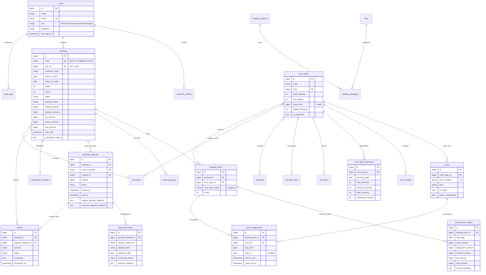

# 04 — Rancangan Basis Data (ERD)

Mesin: **InnoDB**, charset `utf8mb4`. Seluruh nilai uang berupa `BIGINT` rupiah.

## 4.1 ERD

## 4.2 Batasan Unik yang Menegakkan Aturan Bisnis

| Tabel | Batasan | Menjamin |
|-------|---------|----------|
| `room_type_inventories` | UNIQUE(`room_type_id`, `inventory_date`) | Satu baris inventaris per tipe per tanggal |
| `bookings` | UNIQUE(`code`) | Kode pemesanan tidak pernah bentrok |
| `rate_plans` | UNIQUE(`room_type_id`, `rate_date`) | Satu harga khusus per tanggal |
| `booking_item_nights` | UNIQUE(`booking_item_id`, `stay_date`) | Satu snapshot per malam |
| `payment_attempts` | UNIQUE(`invoice_number`), UNIQUE(`request_id`) | Invoice & request tidak terduplikasi |
| `payment_events` | UNIQUE(`provider`, `provider_request_id`) | **Idempotensi notifikasi** |
| `payment_events` | UNIQUE(`payment_attempt_id`, `payload_hash`) | Cadangan idempotensi bila request id dipakai ulang |
| `rooms` | UNIQUE(`room_number`) | Nomor kamar tunggal |
| `promotions` | UNIQUE(`code`) | Kode promo tunggal |

## 4.3 Indeks Penting

- `bookings`: `code`, `customer_email`, `status`, `payment_status`,
  `check_in_date`, `check_out_date`, `held_until`, gabungan (`status`,`check_in_date`)
- `room_type_inventories`: (`room_type_id`,`inventory_date`)
- `payment_attempts`: `status`, (`booking_id`,`status`)
- `payment_events`: `processing_status`
- `room_assignments`: (`room_id`,`stay_from`,`stay_to`) — untuk deteksi tumpang tindih
- `audit_logs`: `action`, (`entity_type`,`entity_id`), `created_at`

## 4.4 Aturan Penghapusan

| Relasi | Aturan | Alasan |
|--------|--------|--------|
| `booking_items` → `room_types` | `RESTRICT` | Tipe kamar yang pernah dipesan tidak boleh hilang |
| `room_assignments` → `rooms` | `RESTRICT` | Riwayat penugasan kamar dipertahankan |
| `bookings` → `users` | `SET NULL` | Menghapus akun tidak menghapus riwayat pemesanan |
| `booking_items` → `bookings` | `CASCADE` | Item mengikuti induknya |
| `payment_events` → `payment_attempts` | `SET NULL` | Jejak audit pembayaran tetap ada |

Riwayat pemesanan dan pembayaran **tidak pernah dihapus permanen** oleh proses bisnis;
pembatalan hanya mengubah status.
