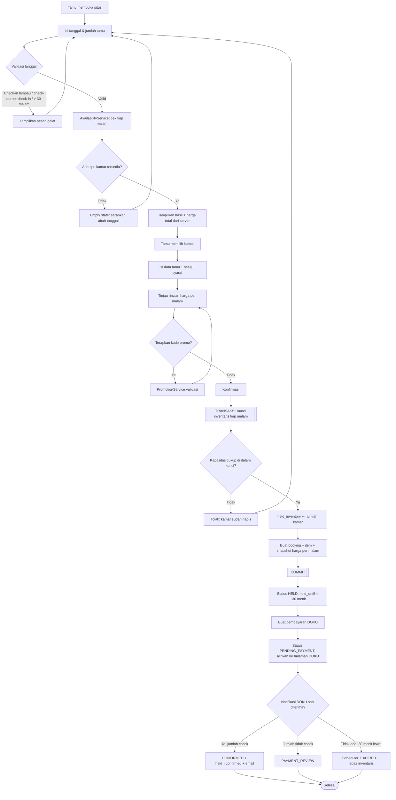
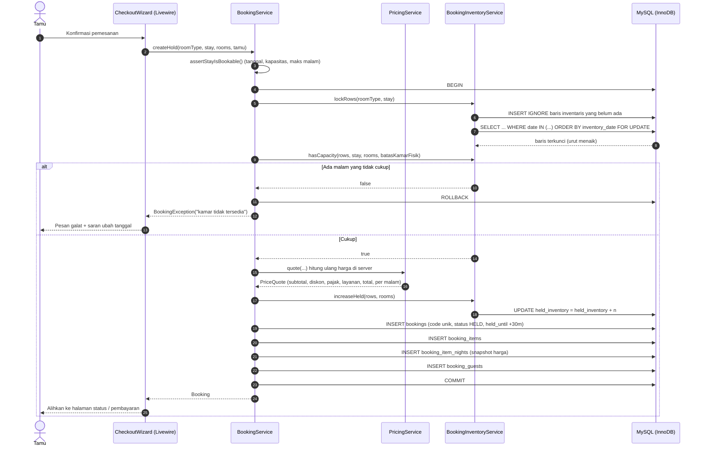

# 05 — Alur Pemesanan

## 5.1 Diagram Aktivitas



## 5.2 Diagram Sekuens — Pembuatan Hold



## 5.3 Skenario Konkurensi

```mermaid
sequenceDiagram
    autonumber
    participant A as Proses A
    participant B as Proses B
    participant DB as InnoDB

    Note over A,B: Tersisa 1 kamar untuk tanggal yang sama

    A->>DB: BEGIN; SELECT ... FOR UPDATE (10, 11 Agu)
    DB-->>A: baris terkunci
    B->>DB: BEGIN; SELECT ... FOR UPDATE (10, 11 Agu)
    Note over B,DB: B MENUNGGU — baris dikunci A

    A->>DB: tersedia = 1 >= 1 → held += 1
    A->>DB: COMMIT
    DB-->>B: kunci dilepas, B membaca nilai TERBARU
    B->>DB: tersedia = 0 → tolak
    B->>DB: ROLLBACK

    Note over A,B: Tepat satu pemesanan berhasil; inventaris tidak pernah negatif
```

Terbukti oleh `tests/Feature/Booking/ConcurrentBookingTest.php`, yang menjalankan
4 dan 6 proses sistem operasi **terpisah** secara bersamaan.

## 5.4 Kedaluwarsa Hold

```mermaid
sequenceDiagram
    autonumber
    participant CR as Cron (tiap menit)
    participant CMD as bookings:expire-holds
    participant ES as BookingExpirationService
    participant DB as MySQL

    CR->>CMD: php artisan schedule:run
    CMD->>ES: expireDueHolds()
    ES->>DB: SELECT bookings HELD/PENDING_PAYMENT dengan held_until < now()
    loop tiap pemesanan
        ES->>DB: BEGIN; SELECT booking FOR UPDATE
        alt Sudah ditangani proses lain
            ES->>DB: ROLLBACK (lewati)
        else Masih kedaluwarsa
            ES->>DB: kunci baris inventaris; held_inventory -= n
            ES->>DB: status = EXPIRED, payment_status = EXPIRED
            ES->>DB: attempt PENDING → EXPIRED
            ES->>DB: COMMIT + audit log
        end
    end
```

Pemeriksaan ulang di dalam kunci membuat perintah ini **aman dijalankan berulang**:
menjalankannya dua kali tidak pernah melepas inventaris dua kali.

## 5.5 Aturan Validasi Pencarian

| Aturan | Pesan |
|--------|-------|
| Check-in ≥ hari ini | "Tanggal check-in tidak boleh sebelum hari ini." |
| Check-out > check-in | "Tanggal check-out harus setelah tanggal check-in." |
| Maksimal 30 malam | "Lama menginap maksimal 30 malam." |
| Jumlah kamar ≥ 1 | "Jumlah kamar minimal 1." |
| Tamu ≤ kapasitas tipe | "Jumlah tamu melebihi kapasitas tipe kamar yang dipilih." |
