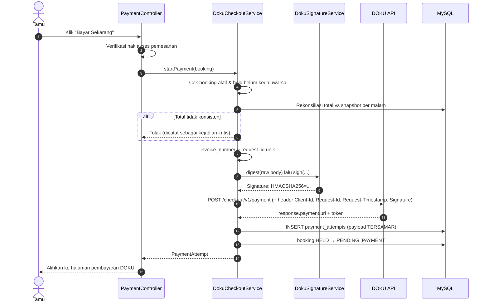

# 06 — Alur Pembayaran DOKU

Referensi resmi:
- <https://developers.doku.com/accept-payments/doku-checkout/integration-guide/backend-integration>
- <https://developers.doku.com/get-started-with-doku-api/signature-component/non-snap/signature-component-from-request-header>

## 6.1 Konfigurasi

| Kunci | Sandbox | Produksi |
|-------|---------|----------|
| Base URL | `https://api-sandbox.doku.com` | `https://api.doku.com` |
| Endpoint | `POST /checkout/v1/payment` | sama |
| Notification URL | `{APP_URL}/webhook/doku/notifications` | sama |

Kredensial hanya dari environment (`config/doku.php`); tidak pernah ditulis di kode
maupun disimpan di basis data.

**Dua mode berdampingan.** Kredensial sandbox dan produksi dikonfigurasi bersamaan
(`DOKU_SANDBOX_*` dan `DOKU_PRODUCTION_*`). Mode mana yang aktif adalah keputusan
runtime yang tersimpan di `system_settings.doku_environment` dan diterapkan saat
boot oleh `DokuServiceProvider`, sehingga perpindahan sandbox ↔ produksi tidak
memerlukan deploy.

Pengalihannya ada di **Admin → Mode Pembayaran DOKU** (`/admin/doku`) dan hanya
dapat diakses peran **Super Admin** — lihat `07-security.md` §7.3b. Setiap
perpindahan wajib disertai alasan dan tercatat di audit log.

Tiga syarat yang mudah terlewat:

1. **Kredensial sandbox tidak berlaku di host produksi**, dan sebaliknya —
   pasangan yang salah dijawab `invalid_client_id`.
2. **Notification URL harus dapat dijangkau dari internet.** DOKU yang memanggil
   kita, bukan sebaliknya; `localhost` tidak akan pernah menerima notifikasi.
3. **Path notification URL ikut ditandatangani.** Mengubah path tanpa mengubah
   pendaftaran di dashboard membuat seluruh signature gagal diverifikasi.

Ketiganya diperiksa otomatis oleh `php artisan doku:check` (lihat §6.8).

Selain itu DOKU menolak permintaan yang `Request-Timestamp`-nya meleset lebih dari
**±3600 detik** dari waktu mereka, sehingga jam server yang tidak sinkron akan
menggagalkan pembayaran (`request_time_out_of_range`).

## 6.2 Signature

Komponen signature disusun satu baris per komponen, dipisahkan `\n`,
**tanpa baris baru di akhir**:

```
Client-Id:<client id>
Request-Id:<request id unik>
Request-Timestamp:<ISO8601 UTC, mis. 2026-07-18T08:45:42Z>
Request-Target:<path saja, mis. /checkout/v1/payment>
Digest:<base64(sha256(raw body))>
```

Kemudian:

```
Signature: HMACSHA256=<base64(hmac_sha256(komponen, secret_key))>
```

Catatan penting:
- `Digest` dihitung atas **byte mentah** yang benar-benar dikirim/diterima,
  bukan hasil encode ulang dari array.
- Permintaan GET tanpa body **tidak** menyertakan baris `Digest`.
- Untuk **notifikasi masuk**, `Request-Target` adalah path notifikasi **milik kita**
  (`/webhook/doku/notifications`) — inilah yang membuat verifikasi webhook bekerja.

Implementasi: `App\Services\Doku\DokuSignatureService`
(diuji pada `tests/Unit/Doku/DokuSignatureServiceTest.php`).

## 6.3 Sekuens Pembuatan Pembayaran



Jumlah yang dikirim **selalu** total dari server (`bookings.total_amount`);
nilai dari peramban tidak pernah dipakai.

Dua detail yang wajib dijaga pada badan permintaan:

- `order.line_items` harus berjumlah **sama persis** dengan `order.amount`.
  Total pemesanan = subtotal − diskon + pajak + layanan, sehingga subtotal per
  kamar saja tidak pernah mencapainya; total dialokasikan proporsional ke setiap
  item dan sisa pembulatan diserap baris terakhir.
- `payment.payment_due_date` dibatasi sisa waktu hold. Halaman pembayaran tidak
  boleh hidup lebih lama daripada penahanan inventaris — bila tidak, tamu dapat
  membayar kamar yang sudah dilepas dan dijual ke orang lain.
- **Teks bebas wajib dibersihkan.** DOKU hanya menerima
  `a-z A-Z 0-9 . - / + , = _ : ' @ % ( )` dan menolak **seluruh** permintaan
  checkout bila ada karakter lain — tanpa menyebut field mana. Nama tamu dan nama
  tipe kamar diketik manusia, sehingga aksen, tanda hubung tipografis, atau emoji
  adalah kejadian wajar. Keduanya ditransliterasi ke ASCII lalu disaring, agar
  "José" tetap terbaca "Jose" dan bukan hilang.

## 6.4 Sekuens Notifikasi (Sumber Kebenaran Pembayaran)

```mermaid
sequenceDiagram
    autonumber
    participant DK as DOKU
    participant EP as POST /webhook/doku/notifications
    participant VF as DokuNotificationVerifier
    participant NS as DokuNotificationService
    participant IS as BookingInventoryService
    participant DB as MySQL
    participant MQ as Queue (email)

    DK->>EP: POST notifikasi (JSON + header signature)
    EP->>EP: Baca RAW body
    EP->>VF: verify(request)
    VF->>VF: Cek header lengkap & Client-Id cocok
    VF->>VF: digest(raw) → hitung ulang signature (Request-Target = path notifikasi)
    VF-->>EP: valid / tidak valid

    EP->>NS: handle(payload, raw, valid, requestId)
    NS->>DB: INSERT payment_events (unik: provider+request_id)
    alt Duplikat (pelanggaran unik)
        DB-->>NS: duplicate
        NS-->>EP: "duplicate"
        EP-->>DK: 200 OK (tanpa efek samping)
    else Baru
        alt Signature tidak valid
            NS->>DB: event = failed + audit keamanan
            NS-->>EP: invalid_signature
            EP-->>DK: 401 Unauthorized
        else Signature valid
            NS->>DB: Cari attempt berdasarkan invoice_number
            alt Invoice tidak dikenal
                EP-->>DK: 404 Not Found
            else Dikenal
                NS->>NS: Cek jumlah & mata uang vs total pemesanan
                alt Tidak cocok
                    NS->>DB: booking → PAYMENT_REVIEW, payment → REVIEW
                    EP-->>DK: 200 OK
                else Cocok & status SUCCESS
                    NS->>DB: BEGIN; SELECT booking FOR UPDATE
                    alt Sudah CONFIRMED
                        NS->>DB: lewati (idempoten)
                    else Hold masih berlaku
                        NS->>IS: kunci inventaris; held → confirmed
                    else Hold sudah kedaluwarsa (pembayaran terlambat)
                        NS->>IS: kunci inventaris; cek ketersediaan lagi
                        alt Tersedia
                            NS->>IS: confirmed += n; tandai pemulihan terlambat
                        else Habis
                            NS->>DB: PAYMENT_REVIEW (butuh refund/penanganan)
                        end
                    end
                    NS->>DB: booking CONFIRMED, payment PAID, attempt PAID
                    NS->>DB: COMMIT + audit log
                    NS->>MQ: Antre email konfirmasi
                    EP-->>DK: 200 OK
                end
            end
        end
    end
```

## 6.5 Pemetaan Status

| `transaction.status` DOKU | Internal | Tindakan |
|---------------------------|----------|----------|
| `SUCCESS` | paid | Konfirmasi (setelah verifikasi jumlah) |
| `PENDING` | pending | Tidak ada perubahan |
| `FAILED` / `VOID` | failed | Attempt gagal; pemesanan tetap dapat dibayar ulang |
| `EXPIRED` | expired | Attempt kedaluwarsa |
| `REFUNDED` | refunded | Ditangani jalur refund |
| **lainnya / tidak dikenal** | **review** | **PAYMENT_REVIEW — tidak pernah dikonfirmasi otomatis** |

Baris terakhir adalah pengaman utama: status baru dari penyedia tidak akan pernah
diam-diam mengonfirmasi pemesanan.

## 6.6 Idempotensi

Dua batasan unik pada `payment_events`:

1. `UNIQUE(provider, provider_request_id)` — notifikasi dengan `Request-Id` sama ditolak.
2. `UNIQUE(payment_attempt_id, payload_hash)` — cadangan bila `Request-Id` dipakai ulang.

Penolakan terjadi di **database**, bukan di logika aplikasi, sehingga dua notifikasi
yang tiba bersamaan pun tetap hanya diproses satu kali. Akibatnya notifikasi ganda
tidak pernah: mengonfirmasi dua kali, mengubah inventaris dua kali, atau mengirim
email konfirmasi dua kali.

## 6.7 Callback Peramban

`GET /payment/callback` **bukan** bukti pembayaran. Halaman ini hanya membaca status
pemesanan saat itu:

- Sudah `CONFIRMED` (notifikasi sudah masuk) → tampilkan keberhasilan.
- Belum → tampilkan **"Pembayaran sedang diperiksa"**, tanpa klaim keberhasilan.

## 6.8 Menyiapkan & Menguji Sandbox

### 6.8.1 Perkakas

| Perintah | Kegunaan |
|----------|----------|
| `php artisan doku:check` | Memeriksa seluruh konfigurasi tanpa memanggil jaringan |
| `php artisan doku:check --ping` | Membuat checkout uji di DOKU untuk membuktikan kredensial |
| `php artisan doku:check --environment=sandbox --ping` | Menguji mode lain **tanpa** mengalihkan mode aktif |
| `php artisan doku:simulate-notification {invoice}` | Mengirim notifikasi bertanda tangan sah ke webhook kita sendiri |
| `php artisan user:make-superadmin {email}` | Memberi hak mengalihkan mode DOKU (CLI saja) |

`doku:check` menolak konfigurasi yang secara diam-diam merusak pembayaran:
kredensial kosong, host sandbox/produksi tertukar, notification URL yang tidak
dapat dijangkau DOKU, path notifikasi yang tidak cocok dengan rute, dan
`DOKU_PAYMENT_DUE_MINUTES` yang melebihi durasi hold.

### 6.8.2 Urutan Penyiapan

1. **Punya akun sandbox.** Sandbox bukan mode di dalam akun produksi, melainkan
   lingkungan terpisah dengan pendaftaran sendiri — akun `dashboard.doku.com`
   tidak berlaku di sana. Daftar di
   <https://sandbox.doku.com/bo/sandbox-registration> (langsung aktif), lalu masuk
   di <https://sandbox.doku.com/bo/login>.
2. Buka **Settings → API Keys** (<https://sandbox.doku.com/bo/developer/api-keys>),
   klik **Reveal Key**, salin **Client ID** (`BRN-xxxx-xxxxxxxxxxxxx`) dan
   **Secret Key** (`SK-xxxxxxxx`) ke `.env`. Secret Key hanya tampil ±30 detik.
3. `php artisan config:clear && php artisan doku:check --ping`
   → harus berakhir "Kredensial DOKU valid."
4. Ekspos aplikasi: `ngrok http 8000`, lalu set `APP_URL` ke URL ngrok tersebut
   dan jalankan ulang `php artisan doku:check` (kini notification URL lolos).
5. Daftarkan Notification URL di dashboard: **Settings → Payment Settings →
   Webhook** → isi endpoint dengan nilai `DOKU_NOTIFICATION_URL`.
   DOKU menolak `localhost`, URL ber-autentikasi, di balik VPN, atau port tidak lazim.
6. Pastikan `php artisan queue:work` dan `php artisan schedule:work` berjalan.

**Domain ngrok berubah tiap kali dijalankan ulang** — tidak perlu mengedit
dashboard setiap kali. Aplikasi mengirim `additional_info.override_notification_url`
pada setiap permintaan checkout, dan DOKU mengizinkan penggantian **host** selama
**path**-nya sama dengan yang terdaftar. Cukup perbarui `APP_URL`.

> Kredensial sandbox dan produksi tidak dapat saling dipakai. Bila `.env` sandbox
> diisi Client ID produksi, DOKU menjawab `invalid_client_id` — inilah kondisi
> yang tercatat pada `PROJECT_STATUS.md` §5.

### 6.8.3 Uji Notifikasi Tanpa Menunggu DOKU

Notifikasi adalah satu-satunya sumber kebenaran pembayaran, jadi jalur itulah
yang paling perlu diuji. Perintah simulasi menandatangani payload dengan
algoritma yang sama dengan DOKU dan menembakkannya ke rute asli:

```bash
php artisan doku:simulate-notification NPS-20260723-ABC123-1                  # sukses
php artisan doku:simulate-notification NPS-...-1 --request-id=r1              # lalu ulangi
php artisan doku:simulate-notification NPS-...-1 --request-id=r1              # → duplicate
php artisan doku:simulate-notification NPS-...-1 --amount=1                   # → PAYMENT_REVIEW
php artisan doku:simulate-notification NPS-...-1 --invalid-signature          # → 401
```

Perintah ini memalsukan pembayaran, sehingga meminta konfirmasi bila
`DOKU_ENVIRONMENT=production`.

### 6.8.4 Transaksi Sandbox Sungguhan

1. Buat satu pemesanan, klik **Bayar Sekarang**, bayar di simulator DOKU.
2. Verifikasi: `payment_events.signature_valid = 1`, booking `CONFIRMED`,
   inventaris berpindah `held → confirmed`, email konfirmasi masuk antrean.
3. Kirim ulang notifikasi yang sama → hasil `duplicate`, tanpa efek ganda.
