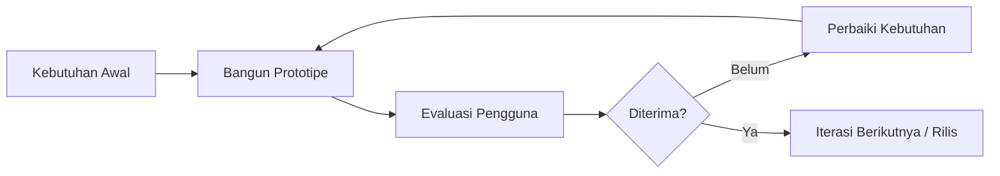

# 10 — Iterasi Prototipe (Metode Prototype)

Pengembangan mengikuti **metode Prototype**: kebutuhan awal → pembuatan prototipe →
evaluasi → perbaikan, berulang hingga diterima.

> **Catatan penting untuk peneliti:** kolom *Umpan Balik Pengguna* dan *Evaluasi*
> pada dokumen ini sengaja dibiarkan sebagai **templat kosong**. Data tersebut harus
> diisi dari sesi evaluasi nyata bersama pihak hotel. Tidak ada hasil wawancara atau
> penilaian yang dibuat-buat di dokumen ini.



---

## Iterasi 1 — Antarmuka & Fondasi

**Kebutuhan awal:** hotel memerlukan wajah daring dan kerangka aplikasi.

**Prototipe yang dibangun**
- Beranda (hero, keunggulan, fasilitas, galeri, FAQ)
- Daftar & detail tipe kamar
- Kerangka autentikasi (login, registrasi, peran)
- Tata letak admin + dashboard awal
- Enum status, pengaturan sistem, audit log

**Artefak:** Fase 1–2 pada `PROJECT_STATUS.md`

**Umpan Balik Pengguna** *(diisi peneliti)*

| Tanggal | Narasumber | Peran | Catatan Umpan Balik |
|---------|-----------|-------|---------------------|
|         |           |       |                     |

**Perubahan yang dilakukan** *(diisi peneliti)*

**Evaluasi** *(diisi peneliti)*

**Status penerimaan:** ☐ Diterima ☐ Diterima dengan catatan ☐ Perlu perbaikan

---

## Iterasi 2 — Basis Data, Ketersediaan, dan Harga

**Kebutuhan awal:** ketersediaan harus akurat dan harga tidak boleh dihitung manual.

**Prototipe yang dibangun**
- Inventaris harian (`room_type_inventories`) dengan batasan unik per tanggal
- `AvailabilityService` (minimum lintas malam, checkout tidak dihitung)
- `PricingService` (dasar, akhir pekan, musiman, tamu tambahan, pajak, layanan)
- `PromotionService` (persentase/nominal, otomatis/berkode, batasan lengkap)
- Kalender inventaris admin (blokir, buka, harga, pembaruan massal)
- Manajemen kamar fisik & fasilitas

**Artefak:** Fase 2–3

**Umpan Balik Pengguna** *(diisi peneliti)*

| Tanggal | Narasumber | Peran | Catatan Umpan Balik |
|---------|-----------|-------|---------------------|
|         |           |       |                     |

**Perubahan yang dilakukan** *(diisi peneliti)*

**Evaluasi** *(diisi peneliti)*

**Status penerimaan:** ☐ Diterima ☐ Diterima dengan catatan ☐ Perlu perbaikan

---

## Iterasi 3 — Pemesanan, Pembayaran, dan Laporan

**Kebutuhan awal:** tamu harus dapat memesan dan membayar sendiri secara daring,
dan hotel memerlukan laporan.

**Prototipe yang dibangun**
- Pencarian ketersediaan + checkout 5 langkah
- Booking hold 30 menit dengan penguncian baris (anti pemesanan ganda)
- Snapshot harga per malam yang bersifat tetap
- Integrasi DOKU Checkout (signature, notifikasi, idempotensi)
- Kedaluwarsa otomatis melalui scheduler
- Email konfirmasi (antrean)
- Laporan + ekspor CSV

**Artefak:** Fase 4–5, 7

**Umpan Balik Pengguna** *(diisi peneliti)*

| Tanggal | Narasumber | Peran | Catatan Umpan Balik |
|---------|-----------|-------|---------------------|
|         |           |       |                     |

**Perubahan yang dilakukan** *(diisi peneliti)*

**Evaluasi** *(diisi peneliti)*

**Status penerimaan:** ☐ Diterima ☐ Diterima dengan catatan ☐ Perlu perbaikan

---

## Iterasi 4 — Operasional, Chatbot, dan Pengamanan

**Kebutuhan awal:** sistem harus mendukung pekerjaan harian front desk dan aman
untuk dipakai publik.

**Prototipe yang dibangun**
- Pembatalan (sesuai kebijakan) dan pencatatan refund berjenjang
- Check-in dengan penugasan kamar fisik anti tumpang tindih
- Check-out, no-show, data tamu
- Chatbot FAQ berbasis database dengan pagar pengaman
- Audit log menyeluruh + halaman galat kustom
- Uji konkurensi multi-proses, uji keamanan

**Artefak:** Fase 6–8

**Umpan Balik Pengguna** *(diisi peneliti)*

| Tanggal | Narasumber | Peran | Catatan Umpan Balik |
|---------|-----------|-------|---------------------|
|         |           |       |                     |

**Perubahan yang dilakukan** *(diisi peneliti)*

**Evaluasi** *(diisi peneliti)*

**Status penerimaan:** ☐ Diterima ☐ Diterima dengan catatan ☐ Perlu perbaikan

---

## Templat Instrumen Evaluasi

### A. Panduan Wawancara (kualitatif)

1. Bagaimana proses reservasi dijalankan sebelum menggunakan sistem ini?
2. Bagian mana dari alur pemesanan yang paling membantu / paling membingungkan?
3. Apakah informasi ketersediaan kamar terasa dapat dipercaya? Mengapa?
4. Apakah rincian harga mudah dipahami sebelum membayar?
5. Untuk admin: berapa lama waktu yang dibutuhkan untuk check-in satu tamu?
6. Fitur apa yang masih kurang?

### B. Kuesioner Kebergunaan (kuantitatif)

Skala 1–5 (1 = sangat tidak setuju, 5 = sangat setuju).

| No | Pernyataan | 1 | 2 | 3 | 4 | 5 |
|----|-----------|---|---|---|---|---|
| 1 | Sistem mudah dipelajari | ☐ | ☐ | ☐ | ☐ | ☐ |
| 2 | Alur pemesanan jelas dan runtut | ☐ | ☐ | ☐ | ☐ | ☐ |
| 3 | Informasi kamar dan harga mudah dipahami | ☐ | ☐ | ☐ | ☐ | ☐ |
| 4 | Proses pembayaran terasa aman | ☐ | ☐ | ☐ | ☐ | ☐ |
| 5 | Tampilan nyaman digunakan di ponsel | ☐ | ☐ | ☐ | ☐ | ☐ |
| 6 | Dashboard admin membantu pekerjaan harian | ☐ | ☐ | ☐ | ☐ | ☐ |
| 7 | Laporan sesuai kebutuhan hotel | ☐ | ☐ | ☐ | ☐ | ☐ |
| 8 | Saya bersedia menggunakan sistem ini | ☐ | ☐ | ☐ | ☐ | ☐ |

**Cara menghitung** (isi setelah data terkumpul):

```
Skor per pernyataan = (Σ skor responden) / (jumlah responden)
Persentase          = (Σ skor) / (5 × jumlah pernyataan × jumlah responden) × 100%
```

| Rentang | Interpretasi |
|---------|--------------|
| 0–20%   | Sangat kurang |
| 21–40%  | Kurang |
| 41–60%  | Cukup |
| 61–80%  | Baik |
| 81–100% | Sangat baik |

### C. Lembar Uji Penerimaan (UAT)

| No | Skenario | Hasil diharapkan | Sesuai? | Catatan |
|----|----------|------------------|---------|---------|
| 1 | Cari kamar dengan tanggal valid | Kamar tersedia tampil beserta total harga | ☐ Ya ☐ Tidak | |
| 2 | Cari dengan check-out sebelum check-in | Muncul pesan galat | ☐ Ya ☐ Tidak | |
| 3 | Pesan kamar terakhir | Berhasil, kamar berkurang | ☐ Ya ☐ Tidak | |
| 4 | Biarkan hold 30 menit | Pemesanan kedaluwarsa, kamar kembali | ☐ Ya ☐ Tidak | |
| 5 | Bayar melalui DOKU | Pemesanan menjadi terkonfirmasi + email | ☐ Ya ☐ Tidak | |
| 6 | Cek pemesanan dengan kode saja | Ditolak | ☐ Ya ☐ Tidak | |
| 7 | Cek pemesanan dengan kode + email | Detail tampil | ☐ Ya ☐ Tidak | |
| 8 | Batalkan pemesanan | Status batal, kamar kembali | ☐ Ya ☐ Tidak | |
| 9 | Admin check-in + pilih kamar | Kamar tertugas, status check-in | ☐ Ya ☐ Tidak | |
| 10 | Admin check-out | Status check-out, kamar bebas | ☐ Ya ☐ Tidak | |
| 11 | Lihat & ekspor laporan | Data sesuai, CSV terunduh | ☐ Ya ☐ Tidak | |
| 12 | Tanya chatbot soal harga | Jawaban sesuai data kamar | ☐ Ya ☐ Tidak | |

Penguji: ____________________  Tanggal: ____________  Tanda tangan: ____________
